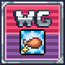

# Content warning
Fetish. Don't like that stuff? Then don't look at it, silly :3

# Wg Terraria Mod

Weight gain mod for tModLoader.
[More info](https://forum.weightgaming.com/t/terraria-weight-gain-mod-proof-of-concept)
- Some elements are inspired by [StarPounds](https://github.com/StarPounds/StarPounds)
- Contributions are very much welcome

# Features
- Basic weight gain mechanics
- Armor sets and fat accessories
- Food items and obtaining different buffs affect weight
- Treadmill for quickly losing weight
- Portable scale for monitoring your weight in kg and lbs
- Sprite set system for making and changing player sprites

# Optional features
These are turned on by default but can be turned off in the mod's settings
- Granular movement speed decrease and damage reduction
- Player hitbox size increase
- Basic jiggle physics
- Dynamic clothing

# Installation
Currently there are no pre-packaged binaries, so you have to compile the source code by yourself. [See the thread](https://forum.weightgaming.com/t/terraria-weight-gain-mod-proof-of-concept)

# Credits
See [description.txt](description.txt) and [Credits.cs](Credits.cs)
